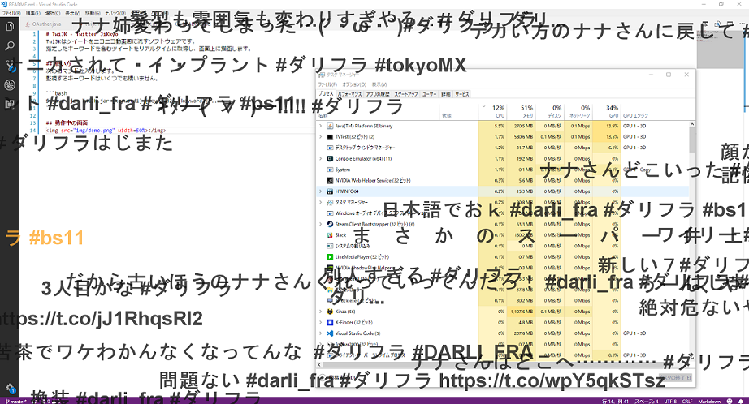

# TwiJK - Twitter JiKkyo
TwiJKはツイートをニコニコ動画風に流すソフトウェアです。
指定したキーワードを含むツイートをリアルタイムに取得し、画面上に描画します。

## 使い方
次のコマンドを入力します。
監視するキーワードはいくつでも構いません。

```bash
$ java -jar twijk.jar [keyword1] [keyword2] [keyword3] ...
```

## 動作中の画面
